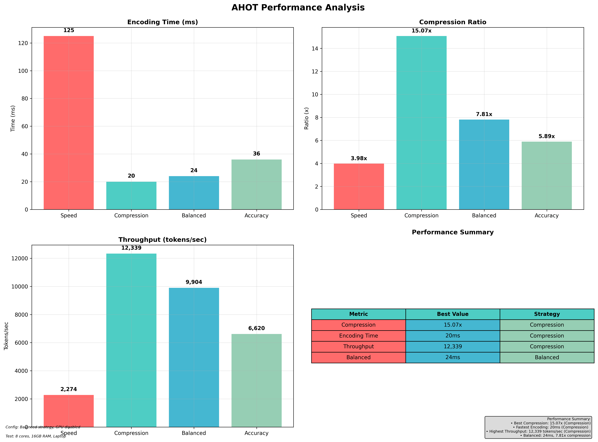
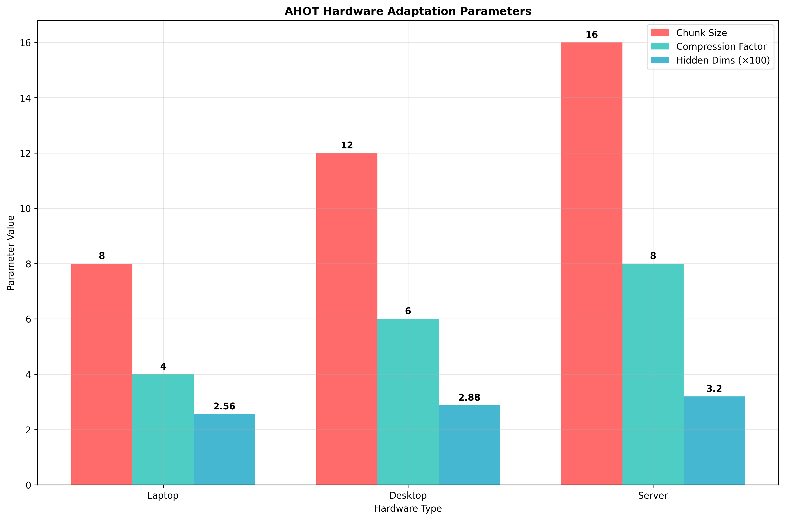

# Adaptive Hardware-Oriented Tokenizer (AHOT)

A tokenizer that adapts to hardware constraints. Optimizes chunk size, compression factor, and model architecture based on CPU cores, memory, and GPU availability.

## What it does

AHOT analyzes your hardware and configures the tokenizer accordingly:
- **Laptop/Desktop**: Smaller chunks, balanced compression
- **Server**: Larger chunks, higher compression
- **GPU Available**: Mixed precision, CUDA optimizations
- **Memory Constrained**: Reduced hidden dimensions

## Performance Visualizations

<table>
<tr>
<td width="50%">

</td>
<td width="50%">

</td>
</tr>
</table>

## Core Features

### Hardware Analysis
```python
from src.ahot import HardwareAnalyzer

analyzer = HardwareAnalyzer()
profile = analyzer.get_profile()
# Returns: device_type, cpu_cores, memory_gb, gpu_info, processing_power
```

### Adaptive Tokenization
```python
from src.ahot import AHOTFactory

# Creates tokenizer optimized for your hardware
tokenizer = AHOTFactory.create_optimized_tokenizer('balanced')
tokens, info = tokenizer.encode("Your text here")

# info contains: encoding_time_ms, compression_ratio, hardware_optimizations
```

### Performance Monitoring
```python
tokenizer.enable_monitoring()
tokens, info = tokenizer.encode("Text to tokenize")
metrics = tokenizer.get_monitoring_metrics()
# Tracks: encoding time, compression ratio, CPU/memory usage, cache hits
```

## Performance

Tested on laptop hardware (8 cores, 16GB RAM):

| Strategy | Encoding Time | Compression | Throughput |
|----------|---------------|-------------|------------|
| Speed | 125ms | 3.98x | 2,274 tokens/sec |
| Compression | 20ms | 15.07x | 12,339 tokens/sec |
| Balanced | 24ms | 7.81x | 9,904 tokens/sec |
| Accuracy | 36ms | 5.89x | 6,620 tokens/sec |

## Installation

```bash
git clone https://github.com/paredezadrian/ahot.git
cd ahot
python -m venv .venv
source .venv/bin/activate  # Windows: .venv\Scripts\activate
pip install -r requirements.txt
```

## Usage

### Basic
```python
from src.ahot import AHOTFactory

tokenizer = AHOTFactory.create_optimized_tokenizer('balanced')
tokens, info = tokenizer.encode("Hello world")
print(f"Tokens: {tokens}")
print(f"Compression: {info['compression_ratio']:.2f}x")
```

### With Monitoring
```python
tokenizer.enable_monitoring()
for text in texts:
    tokens, info = tokenizer.encode(text)

metrics = tokenizer.get_monitoring_metrics()
print(f"Avg time: {metrics['avg_encoding_time_ms']:.2f}ms")
print(f"Cache hit rate: {metrics['cache_hit_rate']:.2f}%")
```

### GPU Acceleration
```python
# Automatically detected and enabled
tokenizer = AHOTFactory.create_optimized_tokenizer('speed')
tokens, info = tokenizer.encode("GPU test")
print(f"GPU: {info['hardware_optimizations']['gpu_acceleration']}")
```

## Architecture

### Core Components
- **HardwareAnalyzer**: Profiles CPU, memory, GPU
- **AdaptiveChunkingLayer**: Dynamic chunk size based on hardware
- **AHOTTokenizer**: Main tokenizer with hardware adaptation
- **ProductionMonitor**: Real-time performance tracking

### Optimization Strategies
- **speed**: Small chunks, high compression factor
- **compression**: Large chunks, maximum compression
- **balanced**: Medium chunks, balanced settings
- **accuracy**: Small chunks, low compression for quality

## Benchmarking

```python
from src.ahot_benchmark import AHOTBenchmarker

benchmarker = AHOTBenchmarker()
benchmarker.run_full_benchmark_suite()
# Generates: benchmark_results.json, benchmark_analysis.png
```

## Development

### Run Tests
```bash
python Demonstrations/enhanced_ahot_demo.py
python run_full_benchmark.py
```

## Implementation Details

### Hardware Detection
- CPU cores via `psutil.cpu_count()`
- Memory via `psutil.virtual_memory()`
- GPU via `torch.cuda.is_available()`
- Device classification: laptop/desktop/server

### Adaptive Parameters
- **Chunk Size**: 4-16 based on memory
- **Compression Factor**: 2-8 based on CPU cores
- **Hidden Dimensions**: 192-320 based on memory
- **GPU Precision**: FP16 when memory > 8GB

### Monitoring
- Background thread tracks performance
- JSON export for analysis
- Cache hit rate calculation
- Memory/GPU usage tracking

## License

Apache 2.0

## Citation

If you use AHOT in your research, please cite:

```bibtex
@software{ahot2025,
  title={Adaptive Hardware-Oriented Tokenizer (AHOT)},
  author={Paredez, Adrian},
  year={2025},
  url={https://github.com/paredezadrian/ahot},
  note={A hardware-adaptive tokenizer with production monitoring and GPU acceleration}
}
``` 